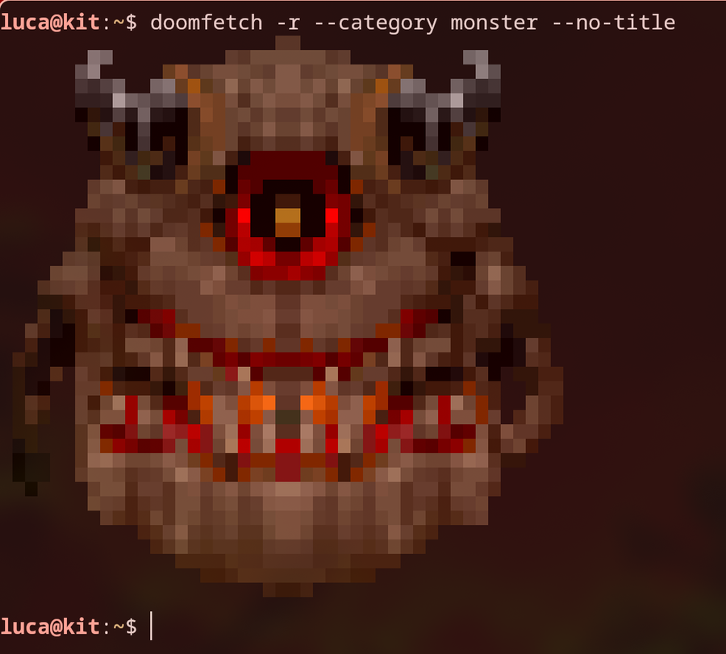
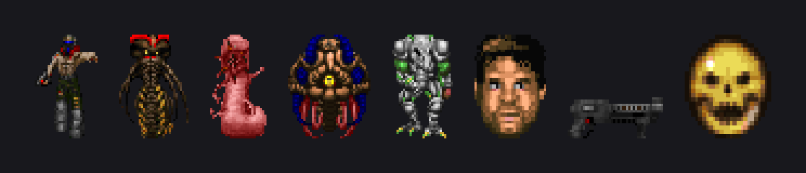

# doomfetch

Sprites from **Doom (1993)** as ANSI art in your terminal — the Doom answer to
[pokemon-colorscripts](https://gitlab.com/phoneybadger/pokemon-colorscripts).
Drop a Cacodemon next to your `fastfetch` output, or get a random Imp every
time you open a shell.



*A Pain Elemental, straight out of `DOOM2.WAD`.*

## How it works

There is no bundled sprite pack. doomfetch reads a Doom IWAD directly:
it walks the lump directory, decodes the sprites out of the
[Doom picture format](https://doomwiki.org/wiki/Picture_format), colours them
through the WAD's own `PLAYPAL` palette, and renders each one to a plain text
file full of ANSI escapes. That happens **once, at install time**, so showing a
sprite later is just `cat`-ing a small file — no startup cost worth measuring.

Rendering uses half block characters: every terminal cell carries two stacked
pixels, `▀` with the upper pixel as foreground and the lower as background.
Sprite heights are corrected by a factor of 1.2 first, because Doom renders a
320x200 framebuffer onto a 4:3 screen, so its pixels are taller than they are
wide. Skip that and every demon comes out looking squashed.

## Requirements

- Python 3.8+ with [Pillow](https://pillow.readthedocs.io/)
  (`python-pillow` on Arch, `python3-pil` on Debian/Ubuntu)
- A terminal with 24-bit colour — kitty, WezTerm, Alacritty, foot, Ghostty,
  modern GNOME Terminal / Konsole all qualify
- A Doom IWAD (see below)

## Install

```bash
git clone https://github.com/lukida99/doomfetch
cd doomfetch
./install.sh
```

`install.sh` looks for an IWAD in the usual places — `$DOOMWADDIR`, the Steam
and GOG install directories, `/usr/share/games/doom` and friends. If it finds
nothing, tell it what to use:

```bash
./install.sh --wad ~/games/DOOM2.WAD   # your own copy
./install.sh --freedoom                # download Freedoom, freely licensed
./install.sh --shareware               # download the Doom 1 shareware WAD
```

Removing it again:

```bash
./install.sh --uninstall
```

### Which IWAD gets you what

| IWAD | Sprites | Notes |
|---|---|---|
| `DOOM2.WAD` | all of them | Revenant, Mancubus, Arch-Vile, Super Shotgun, Megasphere |
| `DOOM.WAD` (Ultimate Doom) | most | adds Cacodemon, Lost Soul, Cyberdemon, BFG9000 over shareware |
| `freedoom2.wad` | all, redrawn | free BSD-licensed artwork, not id Software's |
| `DOOM1.WAD` (shareware) | episode 1 only | no Cacodemon, no Cyberdemon, no BFG |

Anything Doom-engine works, including `TNT.WAD` and `PLUTONIA.WAD`. Lumps that
a given IWAD does not carry are skipped, and the installer tells you which
ones were missing.

Freedoom is the option that needs no purchase and no shareware licence. Its
artwork is drawn from scratch, so it is recognisably its own thing rather than
Doom's:



### Getting a WAD out of a GOG installer on Linux

GOG hands you a Windows installer, but the WADs inside are plain files.
[`innoextract`](https://constexpr.org/innoextract/) opens it without Wine:

```bash
innoextract -d out --include doom.wad --include doom2.wad setup_doom_plus_doom_ii_*.exe
```

Note that `--include` matches file names literally — a `*.wad` glob silently
matches nothing. Run `innoextract -l setup_*.exe` first if you are unsure what
is in there.

The *DOOM + DOOM II* re-release ships each IWAD twice: `doom2.wad` at the top
level is the 2024 KEX build, and `dosdoom/base/doom2/DOOM2.WAD` is the
untouched DOS original. Both yield the full sprite set, but the re-release
replaced the red cross on the medikit, stimpack and berserk pack with a green
one for trademark reasons. If you want the 1994 look, take the `dosdoom` copy.

Dropping the WAD in `~/.local/share/games/doom/` means `./install.sh` finds it
on its own from then on.

## Usage

```bash
doomfetch                      # random sprite
doomfetch -n cacodemon         # a specific one
doomfetch -r -c monster        # random, restricted to a category
doomfetch -r --names imp,baron,revenant
doomfetch --list               # everything this install has
doomfetch --no-title           # no name printed above the sprite
```

Categories are `monster`, `face`, `weapon`, `ammo`, `item`, `key` and `prop`.
The `face` category holds the status bar mugshots — Doomguy grinning, hurt,
in god mode, and dead.

## Using it with fastfetch

fastfetch cannot run an external command for its logo, so doomfetch goes in as
the first module instead:

```jsonc
{
    "logo": { "type": "none" },
    "modules": [
        {
            "type": "command",
            "text": "doomfetch -r --category monster --no-title",
            "key": "\n"
        },
        "title", "os", "kernel", "uptime", "memory"
    ]
}
```

A complete config sits in [`examples/fastfetch-config.jsonc`](examples/fastfetch-config.jsonc).
For bash, zsh, fish, neofetch and SSH login banners, see
[`examples/shell-integration.md`](examples/shell-integration.md).

## Sizing

Sprites default to at most 24 rows and 44 columns. If that is too much real
estate:

```bash
./install.sh --max-rows 16 --max-cols 30
```

`--max-scale` caps how far small pickups get blown up (default `3.0`). All
three can also be passed straight to `build/build.py` if you want to rebuild
without reinstalling the CLI.

## Adding sprites

Every sprite is one line in [`build/sprites.py`](build/sprites.py):

```python
"cacodemon": ("HEADA1", "Cacodemon", "monster", "doom"),
#              lump      title        category   first IWAD it appears in
```

Lump names follow `NAMEFR` — four characters of identity, a frame letter, and
a rotation digit (`1` faces the viewer, `0` means rotation-less, which is what
items use). To see what a WAD actually contains:

```bash
python3 -c "import sys; sys.path.insert(0,'build'); from wad import Wad; \
  w=Wad('/path/to/DOOM2.WAD'); print(sorted({n[:4] for n in w.sprite_names()}))"
```

The status bar faces (`STF*`) sit outside the `S_START`/`S_END` markers and are
addressed by their full lump name.

PRs adding sprites are welcome. Please do not attach extracted graphics to
them — the lump name is all that is needed.

## Licensing and assets

The code here is MIT. **No game content is included, and none should ever be
committed** — `.gitignore` blocks `*.wad` for that reason.

Doom's sprites are copyright id Software. Extracting them on your own machine
from a copy you own is your business; redistributing them in a public repo is
not something this project will do. That is why sprites are built locally at
install time.

If you want a fully free setup, `--freedoom` gets you
[Freedoom](https://freedoom.github.io/), which is BSD-licensed original
artwork built to the same lump names. The `--shareware` option fetches the
Doom 1 shareware IWAD, which id Software released for free redistribution.

## Credits

- [pokemon-colorscripts](https://gitlab.com/phoneybadger/pokemon-colorscripts)
  by phoneybadger — the idea, and the CLI shape this one mirrors
- id Software — Doom, and for putting the shareware episode out into the world
- The [Freedoom](https://freedoom.github.io/) project
- [doomwiki.org](https://doomwiki.org/) — the WAD and picture format documentation
